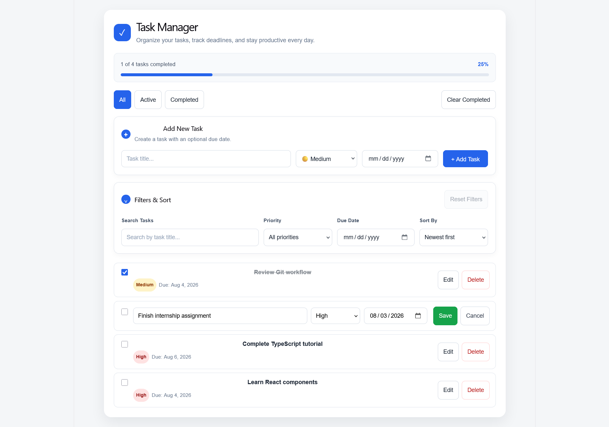
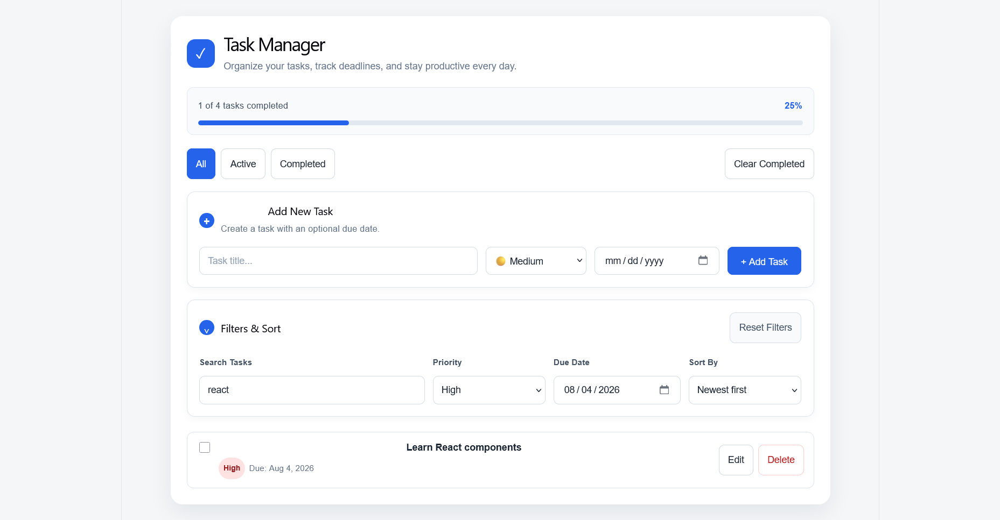

# Task Manager

A modern Task Manager web application built with **React**, **TypeScript**, and **Vite**.

The application helps users organize daily tasks, track progress, and improve productivity through task management features such as task creation, editing, filtering, sorting, and due dates.

---

## Features

- Add new tasks
- Edit existing tasks
- Delete tasks
- Mark tasks as completed
- Search tasks by title
- Filter tasks by:
  - Status
  - Priority
  - Due Date
- Sort tasks by:
  - Newest
  - Oldest
  - Due Date
  - Priority
- Reset all filters
- Track task completion progress
- Responsive user interface
- Persist tasks using Local Storage

---

## Project Evolution

### Version 1 — React & TypeScript Foundation

The first version establishes the core Task Manager as a multi-component React and TypeScript application.

#### Implemented

- Built the application using reusable React components
- Used TypeScript for task types and component props
- Added task creation, editing, deletion, and completion
- Added task searching
- Added filtering by status, priority, and due date
- Added sorting by newest, oldest, due date, and priority
- Added filter reset functionality
- Added completion percentage tracking
- Added responsive styling
- Used Local Storage to persist tasks after page refresh

#### Technologies

- React
- TypeScript
- Vite
- CSS
- Local Storage API

---

## Screenshots

### Main Dashboard

The main interface displaying the task list, progress summary, task creation form, and filtering controls.


### Edit Task

Edit an existing task by updating its title, priority, and due date.



### Search, Filter & Sort

Search tasks by title, filter them by priority or due date, and sort them using different options.



---

## Project Structure

```text
task-manager/
│
├── public/
├── src/
│   ├── components/
│   ├── types/
│   ├── App.tsx
│   ├── App.css
│   ├── index.css
│   └── main.tsx
│
├── screenshots/
├── package.json
├── package-lock.json
├── vite.config.ts
├── tsconfig.json
└── README.md
```

---

## Getting Started

Install the project dependencies:

```bash
npm install
```

Start the development server:

```bash
npm run dev
```

---

## Build for Production

```bash
npm run build
```
